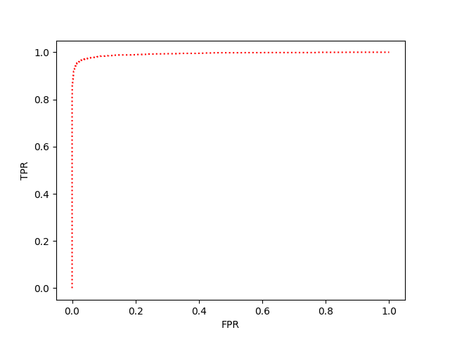

# What's here?

## training

``train.py``

Usage: 

```
if __name__ == "__main__":

    Args = argparse.ArgumentParser(description="Training of Malware Finding Model")
    Args.add_argument("-g", "--goodware", help="Path to directory containing safe apps")
    Args.add_argument("-m", "--malware", help="Path to directory containing malware apps")
    Args.add_argument("-c", "--config", default="files/config.yaml", help="Path to config file")
    args = Args.parse_args()

    main(args.goodware, args.malware, args.config)


```


The trained model will then reside in ``files/model``. Also you will find a file ``word.dict`` which contains the 
extracted strings (the string embedding).

## Re-training

How to retrain? ``retrain.py``.

```
if __name__ == "__main__":

    Args = argparse.ArgumentParser(description="Training of Malware Finding Model")
    Args.add_argument("-g", "--goodware", help="Path to directory containing safe apps")
    Args.add_argument("-m", "--malware", help="Path to directory containing malware apps")
    Args.add_argument("-t", "--trainedmodel", default="files/model", help="Path to directory with the model file")
    Args.add_argument("-c", "--config", default="files/config.yaml", help="Path to config file")
    args = Args.parse_args()

    main(args.goodware, args.malware, args.config)
```

The model must reside in the path given by the ``-t <trainedmodel>`` parameter.

The resulting model will be stored in ``files/model``.


## Performance evaluation and metrics and jupyter notebooks

Please take a look at the jupyter notebook ``MAL2_visualizations.ipynb``.





